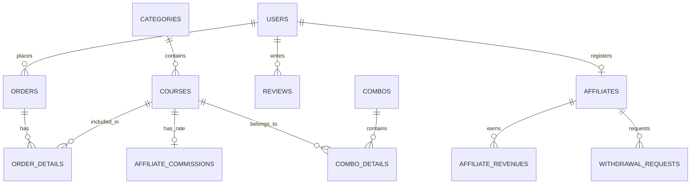

# Thiết Kế Cơ Sở Dữ Liệu (Database Design & ERD)

> **Dự án:** EduLearn Online Platform  
> **Thư mục:** `edu-learn-doc/architecture/`  

---

## 1. Sơ đồ Quan hệ Thực thể (ERD Diagram)

---

## 2. Chi tiết Danh sách Bảng CSDL (Table Schemas)

### 2.1 Bảng `users` (Người dùng & Phân quyền)
| Tên cột | Kiểu dữ liệu | Ràng buộc | Mô tả |
|---------|-------------|-----------|-------|
| `id` | TEXT | PRIMARY KEY | Mã người dùng (UUID / String) |
| `full_name` | TEXT | NOT NULL | Họ và tên |
| `email` | TEXT | UNIQUE, NOT NULL | Địa chỉ Email đăng nhập |
| `phone` | TEXT | | Số điện thoại liên hệ |
| `password` | TEXT | NOT NULL | Mật khẩu đã hash bằng Bcrypt |
| `avatar` | TEXT | | Đường dẫn ảnh đại diện |
| `role` | TEXT | DEFAULT 'USER' | Vai trò: `USER`, `MANAGER`, `STAFF`, `AFFILIATE`, `ADMIN` |
| `status` | TEXT | DEFAULT 'active' | Trạng thái: `active`, `blocked` |
| `must_change_password` | INTEGER | DEFAULT 0 | Cờ bắt buộc đổi mật khẩu khi đăng nhập |
| `created_at` | TEXT | NOT NULL | Thời gian tạo tài khoản |

---

### 2.2 Bảng `courses` (Khóa học)
| Tên cột | Kiểu dữ liệu | Ràng buộc | Mô tả |
|---------|-------------|-----------|-------|
| `id` | TEXT | PRIMARY KEY | Mã khóa học |
| `title` | TEXT | NOT NULL | Tiêu đề khóa học |
| `description` | TEXT | | Mô tả ngắn |
| `image` | TEXT | | Ảnh bìa khóa học |
| `video_intro` | TEXT | | Đường dẫn video xem thử |
| `price` | INTEGER | NOT NULL | Giá niêm yết (VNĐ) |
| `sale_price` | INTEGER | | Giá bán ưu đãi (VNĐ) |
| `category_id` | TEXT | FOREIGN KEY | Mã danh mục khóa học |
| `instructor` | TEXT | | Tên giảng viên |
| `status` | TEXT | DEFAULT 'published'| Trạng thái: `published`, `hidden` |
| `content_html` | TEXT | DEFAULT '' | Nội dung mô tả chi tiết bằng HTML |
| `highlights` | TEXT | DEFAULT '[]' | Danh sách điểm nổi bật (JSON Array) |
| `curriculum` | TEXT | DEFAULT '[]' | Chương trình bài học & Link Drive (JSON Array) |

---

### 2.3 Bảng `orders` & `order_details` (Đơn hàng)
- **`orders`**: Lưu `id`, `user_id`, `total`, `payment_method`, `status` (`pending`, `completed`, `cancelled`), `payment_status` (`chua_thanh_toan`, `da_thanh_toan`), `payment_proof` (đường dẫn ảnh chuyển khoản), `created_at`.
- **`order_details`**: Lưu `order_id`, `course_id`, `price`. PRIMARY KEY (`order_id`, `course_id`).

---

### 2.4 Bảng Phân hệ Tiếp thị liên kết (Affiliate Tables)
- **`affiliates`**: `id`, `user_id`, `full_name`, `email`, `phone`, `bank_name`, `bank_account`, `status` (`pending`, `active`), `ctv_code`, `ma_ctv`, `affiliate_link`.
- **`affiliate_revenues`**: `id`, `affiliate_id`, `order_id`, `course_id`, `order_total`, `commission_rate`, `commission_amount`, `status` (`pending`, `approved`, `paid`, `cancelled`).
- **`withdrawal_requests`**: `id`, `affiliate_id`, `amount`, `bank_name`, `bank_account`, `account_holder`, `status` (`pending`, `completed`, `rejected`), `admin_note`.

---

### 2.5 Các Bảng CMS & Cài đặt (Banners, Coupons, Blogs, Pages)
- **`coupons`**: `id`, `code`, `discount`, `quantity`, `used_count`, `expired_date`, `status`, `usable_by`, `max_discount`, `min_order_amount`.
- **`blogs`**: `id`, `title`, `excerpt`, `content`, `image`, `created_at`.
- **`banners`** & **`home_banner_settings`**: Quản lý hình ảnh và thống kê trên Banner trang chủ.
