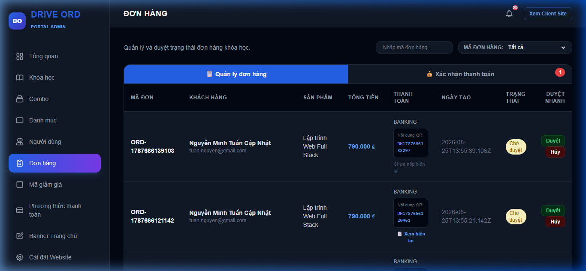
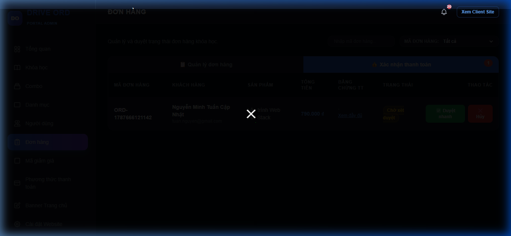

# Quản lý Đơn hàng & Xác nhận Thanh toán

Tài liệu hướng dẫn dành cho Quản trị viên (`MANAGER` / `STAFF`) trong việc theo dõi danh sách giao dịch, đối soát biên lai chuyển khoản và phê duyệt/hủy đơn hàng trên hệ thống EduLearn.

---

## 1. Truy cập chức năng

Truy cập theo đường dẫn: `Admin Dashboard → Đơn hàng` (hoặc truy cập trực tiếp URL: `/admin/orders`).

---

## 2. Giao diện chức năng chính

Giao diện Quản lý Đơn hàng được thiết kế theo dạng **2 Tab chuyên biệt**:
1. **📋 Tab Quản lý đơn hàng**: Xem toàn bộ lịch sử đơn hàng, tra cứu nhanh, duyệt hoặc hủy đơn.
2. **💰 Tab Xác nhận thanh toán**: Màn hình chuyên dụng để kiểm tra ảnh biên lai thanh toán và duyệt nhanh giao dịch.

---

## 3. Tab 1: Quản lý Đơn hàng

### 3.1 Bộ lọc và Tìm kiếm thông minh
* **Ô tìm kiếm tức thì**: Nhập mã đơn hàng (`ORD...`, `CTV...`), họ tên khách hàng, địa chỉ email, hoặc tên khóa học. Bảng kết quả sẽ tự động lọc dữ liệu ngay khi gõ.
* **Bộ lọc loại đơn hàng**:
  * **Tất cả**: Hiển thị toàn bộ các đơn hàng.
  * **Đơn CTV (`CTV...`)**: Chỉ hiển thị các đơn hàng được mua thông qua kênh tiếp thị liên kết (Cộng tác viên).
  * **Đơn thường (`ORD...`)**: Chỉ hiển thị các đơn hàng do người dùng mua trực tiếp.

### 3.2 Cấu trúc bảng danh sách đơn hàng
| Tên cột | Ý nghĩa & Dữ liệu hiển thị |
|:---|:---|
| **Mã đơn** | Mã định danh duy nhất của đơn hàng (ví dụ: `ORD-1725000000` hoặc `CTV-1725000000`). |
| **Khách hàng** | Hiển thị Họ và tên kèm địa chỉ Email của người đặt mua. |
| **Sản phẩm** | Danh sách tên các khóa học hoặc gói combo nằm trong đơn hàng. |
| **Tổng tiền** | Số tiền thanh toán cuối cùng sau khi đã trừ giảm giá (VND). |
| **Thanh toán** | Phương thức thanh toán (`QR_BANKING`, `BANKING`, `MOMO`), nội dung chuyển khoản QR, và nút **"📄 Xem biên lai"** nếu khách hàng đã tải ảnh chứng từ lên. |
| **Ngày tạo** | Thời điểm khách hàng thực hiện đặt đơn hàng. |
| **Trạng thái** | Huy hiệu trạng thái: • **Chờ duyệt** (`pending`): Đang chờ quản trị viên xử lý. • **Đã xong** (`completed`): Đơn hàng đã hoàn tất, học viên đã được kích hoạt khóa học. • **Đã hủy** (`cancelled`): Đơn hàng đã bị hủy bỏ. |
| **Thao tác** | • Nút **[Duyệt]**: Chuyển trạng thái đơn sang `completed` và kích hoạt khóa học cho học viên. • Nút **[Hủy]**: Hủy bỏ đơn hàng (`cancelled`). |

---

## 4. Tab 2: Xác nhận Thanh toán (Duyệt biên lai)

Tab này gom nhóm tất cả các đơn hàng **đã có ảnh chụp bằng chứng chuyển khoản (`payment_proof`)** nhưng **chưa được duyệt thanh toán (`payment_status = 'chua_thanh_toan'`)**.

### Quy trình duyệt biên lai:
1. Nhấn trực tiếp vào ảnh hoặc nút **"Xem đầy đủ"** để mở cửa sổ Modal phóng to ảnh chụp màn hình biên lai chuyển khoản của khách hàng.
2. Đối soát số tiền, mã đơn hàng/nội dung giao dịch trên tài khoản ngân hàng của trung tâm.
3. Thực hiện thao tác:
   * Nhấn nút **✅ Duyệt nhanh**: Hệ thống tự động cập nhật `payment_status = 'da_thanh_toan'` và `status = 'completed'`, đồng thời mở quyền truy cập khóa học cho học viên ngay lập tức (nếu là đơn CTV, hoa hồng sẽ được ghi nhận cho CTV tương ứng).
   * Nhấn nút **❌ Hủy**: Hủy bỏ đơn hàng nếu phát hiện biên lai giả mạo hoặc chuyển tiền không hợp lệ.

---

## 5. Phân trang dữ liệu
- Bảng đơn hàng được tự động phân trang với giới hạn **10 đơn hàng / trang**.
- Quản trị viên sử dụng nút **Trước / Sau** ở góc dưới cùng bên phải để chuyển trang dễ dàng.
