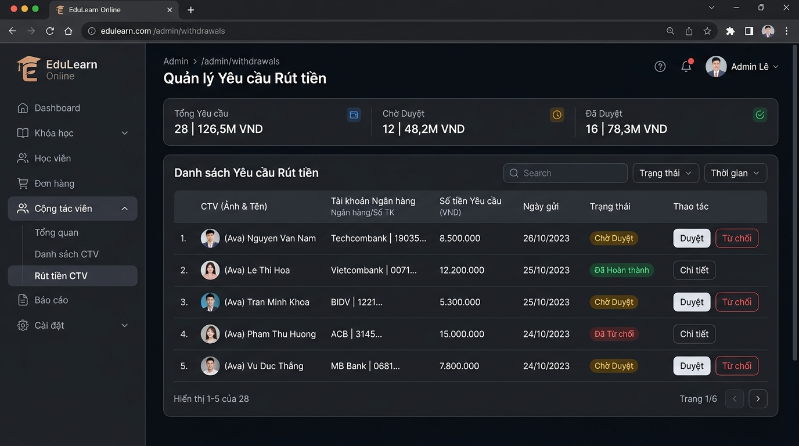
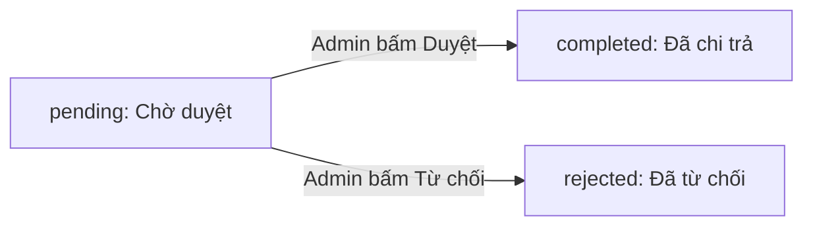

# Quản trị Tiếp thị liên kết & Rút tiền (Admin Affiliate & Withdrawals) - Phiên bản v2

> **Phiên bản:** 2.0 (Cập nhật sau kiểm thử tĩnh & rà soát tài liệu ORD-671 / ORD-503)  
> **Áp dụng cho:** Vai trò `MANAGER` và `STAFF` trên hệ thống **EduLearn Online**

---

## 1. Cấu trúc Menu Quản trị

Hệ thống quản trị cung cấp 2 phân hệ độc lập phục vụ cho nghiệp vụ Affiliate:
1. **Quản lý Danh sách Cộng tác viên:**
   * **Đường dẫn:** `Admin Dashboard → Quản lý Cộng tác viên` (URL: `/admin/affiliates`)
   * **API Backend:** `GET /api/admin/affiliates`, `PUT /api/admin/affiliates/:id/status`
   * **Chức năng:** Duyệt đơn đăng ký CTV mới, quản lý thông tin, phân bổ mã giới thiệu, cập nhật trạng thái hoạt động.
2. **Quản lý Yêu cầu Rút tiền:**
   * **Đường dẫn:** `Admin Dashboard → Rút tiền CTV` (URL: `/admin/withdrawals`)
   * **API Backend:** `GET /api/admin/withdrawals`, `PUT /api/admin/withdrawals/:id/status`
   * **Chức năng:** Tiếp nhận, kiểm tra tài khoản thụ hưởng, thực hiện chuyển tiền và xác nhận duyệt hoặc từ chối các lệnh rút tiền.

---

## 2. Quản lý Danh sách Cộng tác viên (Affiliates)

### Bảng dữ liệu danh sách CTV:
| Cột thông tin | Ý nghĩa |
|:---|:---|
| **Mã CTV** | Mã định danh referral duy nhất của CTV (Ví dụ: `CTV001`, `CTV002`) |
| **Thông tin CTV** | Họ tên, email, số điện thoại liên hệ, tài khoản ngân hàng |
| **Tổng doanh thu** | Tổng giá trị đơn hàng khách hàng đã mua qua link của CTV này |
| **Tổng hoa hồng** | Tổng tiền hoa hồng CTV được hưởng tích lũy |
| **Đã rút** | Số tiền hoa hồng đã chi trả thành công |
| **Số dư khả dụng** | Số dư hoa hồng hiện tại CTV có thể yêu cầu rút |
| **Trạng thái** | Trạng thái hoạt động của tài khoản CTV |

### Các trạng thái chuẩn của tài khoản CTV:
* `pending`: Đơn đăng ký mới tạo, cần Quản trị viên đối soát thông tin để duyệt.
* `approved`: Đã được duyệt thành công, tài khoản CTV đang hoạt động bình thường.
* `rejected`: Đơn đăng ký bị từ chối phê duyệt (cho phép CTV cập nhật và nộp lại).
* `terminated`: Tài khoản đã bị đóng/chấm dứt quyền hoạt động CTV do vi phạm chính sách.

---

## 3. Quy trình Xử lý Yêu cầu Rút tiền (Withdrawals Management)

Mọi yêu cầu rút tiền của CTV được tập trung xử lý tại trang **`/admin/withdrawals`**.

### Điều kiện & Hạn mức hệ thống:
* **Hạn mức rút tối thiểu:** Hệ thống Backend quy định mức rút tối thiểu là **50.000 VNĐ / yêu cầu**.
* **Kiểm tra số dư:** Số tiền rút không được vượt quá số dư khả dụng thực tế của CTV tại thời điểm tạo lệnh.

### Vòng đời trạng thái Yêu cầu Rút tiền:
Hệ thống xử lý trực tiếp theo 3 trạng thái chuẩn:

| Trạng thái | Tên hiển thị | Hành động tương ứng của Quản trị viên |
|:---|:---|:---|
| `pending` | **Chờ Duyệt** | Lệnh rút tiền mới được tạo. Admin kiểm tra số tài khoản ngân hàng và số dư. |
| `completed` | **Đã Hoàn thành** | Sau khi chuyển tiền ngân hàng cho CTV thành công, Admin bấm **Duyệt** để xác nhận đã thanh toán. |
| `rejected` | **Đã Từ chối** | Thông tin ngân hàng không hợp lệ hoặc có nghi vấn gian lận, Admin bấm **Từ chối**. |

### Các bước thao tác duyệt chi trả:
1. Truy cập menu **Rút tiền CTV** (`/admin/withdrawals`).
2. Xem thông tin người nhận: Họ tên CTV, Ngân hàng, Số tài khoản, Số tiền yêu cầu.
3. Thực hiện chuyển khoản số tiền tương ứng qua dịch vụ Internet Banking của ngân hàng.
4. Trên giao diện Admin, nhấn nút **Duyệt** để hệ thống chuyển trạng thái sang `completed` và trừ số dư hoa hồng của CTV.
5. Trường hợp thông tin không hợp lệ, nhấn nút **Từ chối** (`rejected`) để hoàn trả số dư lại ví CTV.
