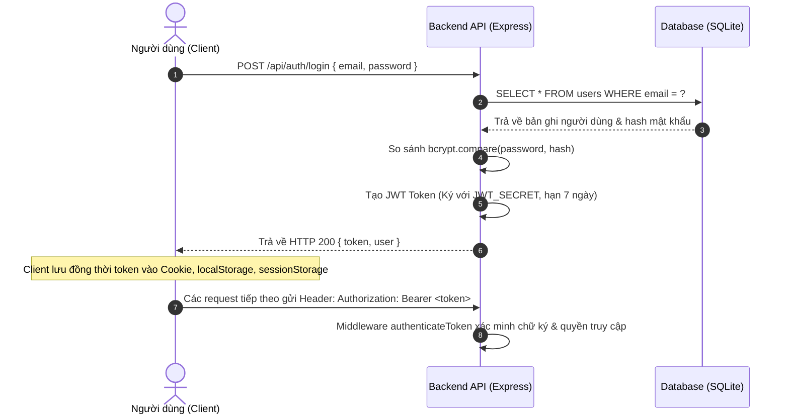

# Xác thực, Phân quyền & Bảo mật (Authentication & Authorization)

Tài liệu mô tả chi tiết cơ chế Xác thực (Authentication), Phân quyền (Authorization), Quản lý Phiên làm việc (Session & Token Storage) và Chính sách Bảo mật trên hệ thống **EduLearn Online**.

---

## 1. Cơ chế Xác thực (Authentication Mechanism)

Hệ thống EduLearn sử dụng chuẩn **JSON Web Token (JWT)** không trạng thái (Stateless) kết hợp thuật toán mã hóa chữ ký số `HS256`.

### Luồng xác thực đăng nhập:


---

## 2. Cấu trúc JWT Payload

Token được Backend ký chứa đầy đủ 6 trường dữ liệu định danh người dùng:

```json
{
  "id": "u-1725184200000",
  "full_name": "Nguyễn Văn A",
  "email": "user@example.com",
  "role": "USER",
  "must_change_password": 0,
  "status": "active",
  "iat": 1725184200,
  "exp": 1725789000
}
```

| Trường (Field) | Kiểu dữ liệu | Ý nghĩa |
|:---|:---|:---|
| `id` | `string` | Định danh duy nhất của người dùng trong CSDL |
| `full_name` | `string` | Họ và tên đầy đủ |
| `email` | `string` | Địa chỉ email đăng nhập |
| `role` | `string` | Vai trò (`USER`, `AFFILIATE`, `MANAGER`, `STAFF`) |
| `must_change_password`| `number` | Cờ báo hiệu yêu cầu bắt buộc đổi mật khẩu trong lần đầu đăng nhập (`1`: Có, `0`: Không) |
| `status` | `string` | Trạng thái tài khoản (`active` / `blocked`) |
| `iat`, `exp` | `number` | Thời điểm phát hành và thời điểm hết hạn (Thời hạn mặc định: **7 ngày**) |

---

## 3. Cơ chế Lưu trữ Token phía Client (Client-Side Storage Architecture)

Để tối ưu hóa trải nghiệm người dùng và hỗ trợ cơ chế bảo vệ Route của **Next.js Middleware (Server-Side)**, phía Client (`frontend/src/lib/utils/auth.ts`) quản lý lưu trữ đồng bộ tại 3 nơi:

1. **Trình duyệt Cookie (`document.cookie`):**
   * *Mục đích:* Cho phép **Next.js Middleware (`frontend/src/middleware.ts`)** đọc được trạng thái phiên làm việc trong quá trình Server-Side Rendering (SSR) để thực hiện điều hướng bảo vệ trang.
   * *Lưu ý kỹ thuật:* Cookie này được tạo và quản lý trực tiếp từ mã nguồn JavaScript Client-side (với cờ `path=/`, `SameSite=Lax`), **không phải là HttpOnly Cookie** do máy chủ thiết lập.
2. **`localStorage`:**
   * *Mục đích:* Lưu trữ bền vững `token` và đối tượng `user` trên trình duyệt để tự động khôi phục phiên đăng nhập khi người dùng mở lại tab.
3. **`sessionStorage`:**
   * *Mục đích:* Lưu trữ phiên làm việc tạm thời trong vòng đời của tab trình duyệt.

Khi người dùng thực hiện **Đăng xuất (Logout)**: Hệ thống sẽ tự động xóa sạch dữ liệu tại cả Cookie, `localStorage` và `sessionStorage`.

---

## 4. Cấu hình CORS & Ranh giới Endpoint Công khai (Public Routes)

### 4.1 Cấu hình CORS (Cross-Origin Resource Sharing):
* Trong môi trường hiện tại, máy chủ Backend cấu hình:
  ```javascript
  app.use(cors({
    origin: '*',
    methods: ['GET', 'POST', 'PUT', 'PATCH', 'DELETE', 'OPTIONS'],
    allowedHeaders: ['Content-Type', 'Authorization']
  }));
  ```
  *(Cho phép các Client từ các Origin khác nhau kết nối linh hoạt phục vụ phát triển đa nền tảng web & mobile)*.

### 4.2 Danh sách các Endpoint Công khai (Public Endpoints - Không yêu cầu Token):
Hệ thống xác định rõ ràng các trường hợp ngoại lệ cho phép khách vãng lai gửi request mà không cần Header `Authorization`:

* **Authentication:**
  * `POST /api/auth/register` (hoặc `POST /api/register`): Đăng ký tài khoản học viên mới.
  * `POST /api/auth/login` (hoặc `POST /api/login`): Đăng nhập xác thực tài khoản.
  * `POST /api/forgot-password`: Yêu cầu gửi email khôi phục mật khẩu.
  * `POST /api/reset-password`: Đặt lại mật khẩu mới thông qua reset token.
* **Affiliate Tracking:**
  * `POST /api/affiliates/clicks`: Ghi nhận lượt nhấp liên kết tiếp thị từ khách vãng lai.
* **Catalog & Public Content (GET):**
  * `GET /api/courses`, `GET /api/courses/:id`, `GET /api/categories`, `GET /api/combos`, `GET /api/blogs`, `GET /api/site-settings`, `GET /api/faqs`.

---

## 5. Phân quyền truy cập (Role-Based Access Control - RBAC)

### 5.1 Các vai trò người dùng:
| Vai trò | Quyền hạn chi tiết |
|:---|:---|
| **`MANAGER`** | Quản trị viên cấp cao nhất: Toàn quyền quản trị hệ thống, quản lý tài khoản quản trị (`/admin/accounts`), quản lý người dùng (`/admin/users`), cấu hình site và doanh thu. |
| **`STAFF`** | Nhân viên vận hành: Có quyền quản trị khóa học, đơn hàng, combo, mã giảm giá, bài viết blog, duyệt rút tiền. **Bị ẩn và chặn hoàn toàn khỏi các trang quản lý người dùng & tài khoản quản trị**. |
| **`AFFILIATE`** | Đối tác tiếp thị: Được cấp mã giới thiệu riêng, theo dõi thống kê lượt click, đơn hàng, hoa hồng và tạo yêu cầu rút tiền. |
| **`USER`** | Học viên tiêu chuẩn: Mua khóa học, thanh toán, học tập và quản lý tài khoản cá nhân. |

### 5.2 Middleware kiểm soát Backend:
* `authenticateToken`: Giải mã và xác thực tính hợp lệ của JWT.
* `checkUserStatus`: Kiểm tra trạng thái tài khoản trong CSDL (chặn ngay lập tức nếu tài khoản bị khóa `blocked`).
* `requireRole([...roles])`: Chặn đứng các hành vi vượt quyền (Trả về `403 Forbidden` nếu không đủ quyền).

---

## 6. Mã hóa Mật khẩu

* Toàn bộ mật khẩu của người dùng đều được băm bằng thuật toán **bcryptjs** với `salt rounds = 10` trước khi lưu vào CSDL.
* Tuyệt đối không lưu trữ hoặc phản hồi mật khẩu dưới dạng văn bản rõ (Plain Text).
