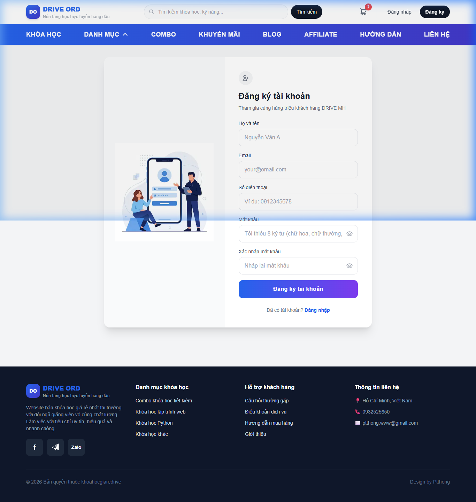
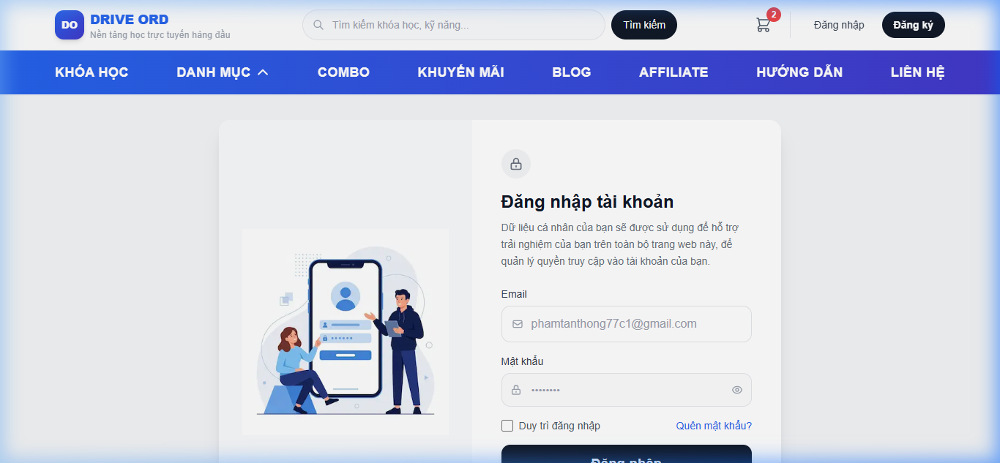
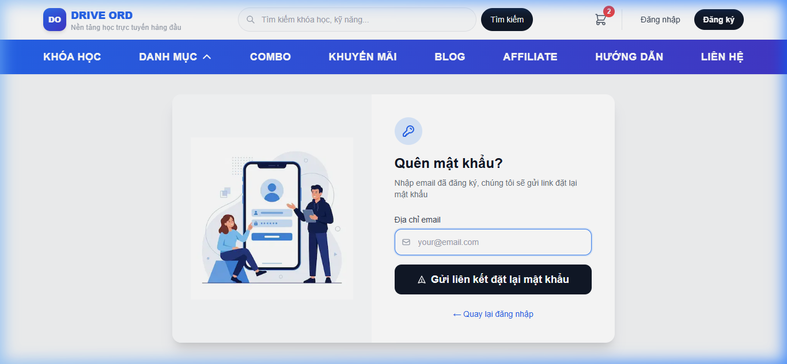

# Hướng dẫn Đăng ký & Đăng nhập

Tài liệu hướng dẫn chi tiết quy trình đăng ký tài khoản mới, đăng nhập, quên mật khẩu và đăng xuất trên hệ thống **EduLearn Online**.

---

## 1. Đăng ký tài khoản mới

### Bước 1: Truy cập trang đăng ký
- Trên Header trang chủ, nhấn nút **Đăng ký** hoặc truy cập trực tiếp đường dẫn: `/register`.

### Bước 2: Điền thông tin đăng ký

Biểu mẫu đăng ký yêu cầu người dùng điền đầy đủ và chính xác các trường thông tin sau:

| Tên trường | Bắt buộc | Quy tắc xác thực (Validation Rules) | Ghi chú & Ví dụ |
|:---|:---:|:---|:---|
| **Họ và tên** | ✅ | Không được để trống | Ví dụ: `Nguyễn Văn A` |
| **Email** | ✅ | Định dạng email hợp lệ (`user@domain.com`), chưa được đăng ký trong hệ thống | Ví dụ: `nguyenvana@gmail.com` |
| **Số điện thoại** | ✅ | Gồm đúng **10 chữ số**, bắt đầu bằng các đầu số hợp lệ của Việt Nam: `03`, `05`, `07`, `08`, `09` | Ví dụ: `0912345678` |
| **Mật khẩu** | ✅ | Tối thiểu **6 ký tự** | Ví dụ: `matkhau123` |
| **Xác nhận mật khẩu** | ✅ | Phải trùng khớp 100% với giá trị đã nhập ở ô Mật khẩu | Phải giống chính xác mật khẩu |

### Bước 3: Hoàn tất đăng ký & Chuyển hướng
- Nhấn nút **Đăng ký tài khoản**.
- Sau khi gửi thông tin thành công, hệ thống sẽ hiển thị thông báo:
  > *"🎉 Đăng ký thành công! Đang chuyển hướng sang Đăng nhập..."*
- Hệ thống tự động chuyển hướng người dùng sang trang **Đăng nhập (`/login`)** sau 1.5 giây để tiến hành đăng nhập với tài khoản vừa tạo.

---

## 2. Đăng nhập hệ thống

### Bước 1: Truy cập trang đăng nhập
- Nhấn nút **Đăng nhập** trên Header hoặc truy cập đường dẫn: `/login`.

### Bước 2: Nhập thông tin xác thực
- **Email**: Nhập địa chỉ email đã đăng ký tài khoản.
- **Mật khẩu**: Nhập mật khẩu tương ứng.

### Bước 3: Xác thực & Điều hướng
- Nhấn nút **Đăng nhập**.
- Sau khi xác thực thành công:
  - Tài khoản học viên (`USER`) / Cộng tác viên (`AFFILIATE`): Được lưu trữ JWT Token an toàn và chuyển về **Trang chủ** (hoặc trang trước đó đang truy cập).
  - Tài khoản Quản trị viên (`MANAGER` / `STAFF`): Được chuyển hướng vào trang **Admin Dashboard (`/admin`)**.

---

## 3. Quên mật khẩu & Khôi phục

1. Trên màn hình Đăng nhập, nhấn vào liên kết **Quên mật khẩu?** (hoặc truy cập `/forgot-password`).

2. Nhập địa chỉ **Email** đã đăng ký tài khoản và nhấn nút **Gửi yêu cầu đặt lại mật khẩu**.
3. Hệ thống gửi đường dẫn khôi phục mật khẩu (chứa Token đặt lại bảo mật) tới hòm thư email của bạn.
4. Mở email, nhấn vào liên kết xác nhận để chuyển đến trang Đặt lại mật khẩu (`/reset-password?token=...`).
5. Nhập mật khẩu mới đáp ứng đủ tiêu chuẩn an toàn (tối thiểu **6 ký tự**) và xác nhận.
6. Đăng nhập lại bằng mật khẩu mới vừa thiết lập.

---

## 4. Đăng xuất tài khoản

1. Nhấp chuột vào biểu tượng **Avatar / Tên tài khoản** ở góc trên cùng bên phải Header.
2. Trong menu thả xuống, chọn mục **Đăng xuất**.
3. Hệ thống sẽ xóa sạch Token phiên làm việc và làm mới trạng thái về giao diện khách vãng lai.
