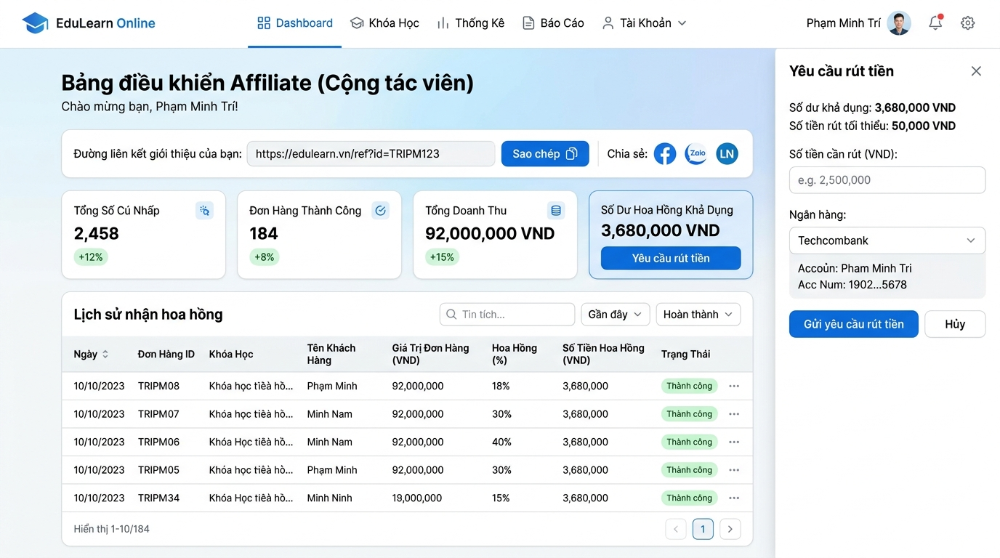

# Hướng dẫn Chương trình Tiếp thị liên kết (Affiliate)

Tài liệu hướng dẫn chi tiết dành cho học viên và đối tác tham gia chương trình **Tiếp thị liên kết (Affiliate / Cộng tác viên)** trên hệ thống **EduLearn Online**.

---

## 1. Tổng quan về Chương trình Affiliate

Chương trình Affiliate cho phép bạn tạo thu nhập thụ động bằng cách chia sẻ liên kết giới thiệu các khóa học, combo học tập trên EduLearn đến bạn bè, học viên hoặc cộng đồng của bạn.

### Cơ chế nhận hoa hồng:
* Mỗi khi khách hàng nhấn vào đường link giới thiệu của bạn và thanh toán đơn hàng thành công, hệ thống sẽ tự động ghi nhận doanh thu và cộng hoa hồng vào ví CTV của bạn.
* Áp dụng cho toàn bộ các sản phẩm trên hệ thống: **Khóa học đơn lẻ** và **Combo khóa học tiết kiệm**.
* Tỷ lệ hoa hồng được áp dụng linh hoạt theo từng chiến dịch do Quản trị viên (Admin) thiết lập (thường từ **10% - 30%**).

---

## 2. Quy trình Đăng ký & Trạng thái xét duyệt

### Các bước tham gia:
1. Đăng nhập vào hệ thống EduLearn.
2. Điều hướng đến mục **Tài khoản cá nhân → Tab Tiếp thị liên kết** (đường dẫn: `/tai-khoan/affiliate`).
3. Nhấn nút **Đăng ký tham gia CTV**.
4. Điền các thông tin liên hệ và gửi đơn đăng ký.

### Vòng đời trạng thái tài khoản Affiliate:
Hệ thống quản lý trạng thái tài khoản CTV theo 4 trạng thái chuẩn:

| Trạng thái | Tên hiển thị | Ý nghĩa chi tiết |
|:---|:---|:---|
| `pending` | **Chờ duyệt** | Đơn đăng ký đã gửi và đang chờ Ban quản trị xét duyệt thông tin. |
| `approved` | **Đã kích hoạt** | Đã được phê duyệt chính thức, được cấp mã giới thiệu riêng và bắt đầu kiếm hoa hồng. |
| `rejected` | **Từ chối** | Đơn đăng ký chưa đạt yêu cầu của hệ thống (có thể đăng ký lại khi bổ sung thông tin). |
| `terminated` | **Đã chấm dứt** | Tài khoản CTV bị tạm ngừng hoặc thu hồi quyền hoạt động do vi phạm chính sách. |

---

## 3. Cách lấy và chia sẻ Link giới thiệu

Sau khi tài khoản đạt trạng thái `approved`, giao diện Affiliate Dashboard sẽ cung cấp:
* **Mã giới thiệu (Referral Code):** Ví dụ `TRIPM123`
* **Đường link giới thiệu đầy đủ:**
  ```text
  https://edulearn.vn/?ref=YOUR_CODE
  ```

### Các kênh chia sẻ hiệu quả:
* Mạng xã hội: Facebook, Zalo, TikTok, YouTube, Threads.
* Blog cá nhân, bài viết đánh giá / review khóa học.
* Hội nhóm học tập, câu lạc bộ sinh viên, lập trình viên.



---

## 4. Quy trình Yêu cầu Rút tiền Hoa hồng (Withdrawals)

### Điều kiện rút tiền hợp lệ:
1. **Số dư khả dụng:** Phải lớn hơn hoặc bằng mức tối thiểu quy định của hệ thống.
2. **Hạn mức rút tối thiểu:** **50.000 VNĐ / lần rút**.
3. Tài khoản nhận tiền phải là tài khoản ngân hàng chính chủ tại Việt Nam.

### Các bước gửi yêu cầu rút tiền:
1. Tại trang **Tài khoản → Affiliate**, nhấn nút **Yêu cầu rút tiền**.
2. Nhập **Số tiền cần rút** (tối thiểu `50.000đ` và không vượt quá số dư khả dụng).
3. Chọn **Tên ngân hàng** và nhập chính xác **Số tài khoản**, **Tên chủ tài khoản**.
4. Nhấn **Gửi yêu cầu rút tiền**.

### Vòng đời trạng thái yêu cầu rút tiền:
| Trạng thái | Tên hiển thị | Ý nghĩa |
|:---|:---|:---|
| `pending` | **Chờ xử lý** | Yêu cầu đã được gửi lên hệ thống và đang chờ kế toán/Admin kiểm tra. |
| `completed` | **Đã chi trả** | Admin đã thực hiện chuyển khoản thành công vào tài khoản ngân hàng của bạn. |
| `rejected` | **Từ chối** | Yêu cầu bị từ chối (ví dụ: sai số tài khoản hoặc thông tin không khớp). |

---

## 5. Theo dõi & Báo cáo hiệu suất kinh doanh

Giao diện Dashboard cập nhật các chỉ số báo cáo thời gian thực:
* **Tổng lượt click:** Tổng số lần đường link giới thiệu được người dùng nhấp vào.
* **Số đơn hàng thành công:** Số lượng đơn hàng đã hoàn tất thanh toán từ link giới thiệu.
* **Tổng doanh thu:** Tổng giá trị tiền tệ các đơn hàng bạn đã mang về cho hệ thống.
* **Số dư hoa hồng khả dụng:** Số tiền hoa hồng hiện tại bạn có thể tạo lệnh rút về ngân hàng.
* **Lịch sử thanh toán:** Bảng kê chi tiết từng giao dịch, thời gian và trạng thái hoa hồng.
